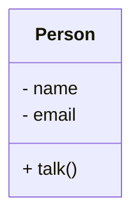

#  **Object-Oriented Programming** (OOP) 🌟

## 📌 What is Object-Oriented Programming?

**Object-Oriented Programming (OOP)** is one of the many **Programming Paradigms**, which are different styles of writing code. OOP is widely used in modern software development to create structured, reusable, and maintainable code.

---

## 🏩 **Types of Programming Paradigms**

There are multiple **programming paradigms**, including:

✅ **Procedural Programming** – Code is structured in procedures or functions. Example: C.</br>
✅ **Functional Programming** – Focuses on pure functions and immutability. Example: Haskell, Lisp.</br>
✅ **Object-Oriented Programming (OOP)** – Organizes code using objects. Example: Java, Python.</br>
✅ **Aspect-Oriented Programming** – Deals with cross-cutting concerns in software design.</br>
✅ **Event-Driven Programming** – Programs respond to events like user actions or messages.</br>

> **Note:** Programming paradigms are not programming languages! Different languages support different paradigms.

For example:
- **JavaScript & TypeScript** support both **Object-Oriented** and **Functional Programming** techniques.
- **Java** is a fully Object-Oriented language.
- **Python** supports multiple paradigms, including OOP and functional programming.

---

## 🔍 **Understanding Object-Oriented Programming**

In **OOP**, we work with **objects** 📦 that contain:

- **Properties (Data)** – Information stored inside an object. Example: A person’s name, email.
- **Methods (Behavior)** – Functions that define what an object can do. Example: A person can talk, walk.

For example, a **Person Object** might have:

```javascript
class Person {
  constructor(name, email) {
    this.name = name; // Property
    this.email = email; // Property
  }
  
  talk() { 
    console.log(`${this.name} is talking`); // Method
  }
}
```

Here, `name` and `email` are **properties**, while `talk()` is a **method**.

---

## 📊 **UML Diagram for Object-Oriented Programming**

Below is a **UML Class Diagram** that represents a simple **Person** object in OOP:



This UML diagram represents:
- **Class Name**: `Person`
- **Properties (Attributes)**: `name`, `email`
- **Methods (Functions)**: `talk()`

---

## 🔗 **Object-Oriented Programming in Real Applications**

In a real-world application, **objects** can represent various entities like:

👉 **User Authentication System** – Objects like `Login`, `UserSession`.</br>
👉 **E-commerce Application** – Objects like `Product`, `Cart`, `Order`.</br>
👉 **Social Media App** – Objects like `Post`, `Comment`, `UserProfile`.</br>

---

## 🔄 **Comparison: OOP vs Functional Programming**

**Functional Programming** is a **different style** where functions are the primary building blocks of applications. It emphasizes **immutability** and **pure functions**.

In **functional programming**:
- Functions are first-class citizens.
- Data is immutable (unchangeable).
- Pure functions do not have side effects.

Example of Functional Programming:

```javascript
const add = (a, b) => a + b;
console.log(add(3, 4)); // Output: 7
```

While OOP focuses on **objects and their interactions**, **functional programming** focuses on **data transformation using functions**.

> **Caution!** Some developers try to solve **every** problem using **only** functional programming, ignoring OOP principles. A balanced approach is recommended.

---

## 📚 **Learning Object-Oriented Programming (OOP)**

If you want to master OOP, it's essential to understand:

🎯 **Encapsulation** – Data hiding inside objects.</br>
🎯 **Abstraction** – Hiding complex implementation details.</br>
🎯 **Inheritance** – Creating new classes based on existing ones.</br>
🎯 **Polymorphism** – Using the same method in different ways.</br>

---

## 🌟 **Conclusion**

Object-Oriented Programming (OOP) is a powerful way to **structure software applications** using **objects**. Understanding OOP principles and using them effectively can help in writing **clean, maintainable, and scalable** code.
