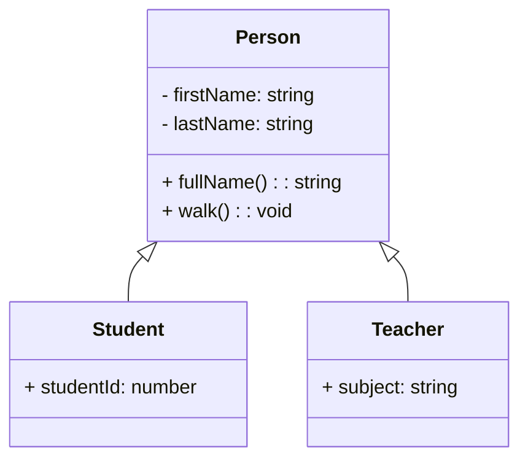

# **Inheritance in TypeScript** 👨‍🏫👩‍🎓

## Introduction 🎯

Inheritance is a core concept in **Object-Oriented Programming (OOP)** that allows classes to share **common properties and methods**. Instead of duplicating code in multiple classes, we define a **base class** containing shared attributes and functionalities. **Derived classes** then inherit these properties, making our code more efficient and reusable. 🚀

### Why Use Inheritance? 🤔

- **Avoids duplication** 🛑
- **Promotes reusability** ♻️
- **Creates a hierarchical structure** 📂
- **Improves code organization** 🏗️

---

## Example Scenario 🎓

Imagine an application managing **Students** and **Teachers**. Both share common properties like:

- `firstName` 📝
- `lastName` 📝
- `fullName()` 📛 (combines first and last names)
- `walk()` 🚶‍♂️ (simulates walking)

Instead of writing the same code in both `Student` and `Teacher` classes, we define a **common base class** called `Person`, from which `Student` and `Teacher` will inherit. 📖

---

## Creating the Base Class `Person` 🏛️

The `Person` class defines common properties and methods.

```typescript
class Person {
    constructor(public firstName: string, public lastName: string) {}

    get fullName(): string {
        return `${this.firstName} ${this.lastName}`;
    }

    walk(): void {
        console.log(`${this.fullName} is walking...`);
    }
}
```

### Explanation 🧐

- The `Person` class includes:
  - A **constructor** initializing `firstName` and `lastName`.
  - A **getter method** `fullName()` to return the **full name**.
  - A **method** `walk()` simulating walking.

---

## Extending `Person` Class (Inheritance) 📚

Now, let's create a `Student` class that **inherits** from `Person` and adds a new property: `studentId`.

```typescript
class Student extends Person {
    constructor(firstName: string, lastName: string, public studentId: number) {
        super(firstName, lastName); // Calls the base class constructor
    }
}
```

### Explanation 📌

- `Student` **extends** `Person`, inheriting all its properties and methods.
- `super(firstName, lastName);` calls the **base class constructor**.
- The property is unique to `Student`.

---

## Creating an Instance of `Student` 👩‍🎓

```typescript
const student = new Student("John", "Doe", 101);
console.log(student.fullName); // ✅ Inherited method
student.walk(); // ✅ Inherited method
console.log(student.studentId); // ✅ Unique to Student class
```

### Explanation ✅

- `fullName` and `walk` are **inherited** from `Person`.
- `studentId` is **specific to Student**.

---

## Adding a `Teacher` Class 👨‍🏫

Similarly, we create a `Teacher` class that extends `Person` and adds an extra property: `subject`.

```typescript
class Teacher extends Person {
    constructor(firstName: string, lastName: string, public subject: string) {
        super(firstName, lastName);
    }
}
```

### Explanation 🏷️

- `Teacher` inherits all properties and methods from `Person`.
- It introduces a **new property** `subject`.

---

## Using Both Classes 📖

```typescript
const teacher = new Teacher("Jane", "Smith", "Mathematics");
console.log(teacher.fullName); // ✅ Inherited method
console.log(teacher.subject); // ✅ Unique to Teacher class
```

### Explanation 🎯

- `Teacher` **inherits** shared properties but also has its **own custom property**.

---

## Best Practices for Inheritance 🛠️

✅ **Use inheritance only when necessary** – sometimes composition (`has-a`) is better than inheritance (`is-a`). ✅ \*\*Always call \*\*\`\` when inheriting from a parent class. ✅ **Ensure the base class is generic enough** for reusability. ✅ **Encapsulate behavior properly** to avoid exposing unnecessary details to child classes.

---

## Mermaid Class Diagram 📊



### Explanation 🧐

- `Person` is the **base class** (superclass).
- `Student` and `Teacher` **inherit** from `Person`.
- `Student` has an **additional property** `studentId`.
- `Teacher` has an **additional property** `subject`.

---

## Key Takeaways 🏆

✅ **Inheritance enables code reuse** efficiently.\
✅ **Base classes define shared properties and methods**.\
✅ **Derived classes extend and add new functionalities**.\
✅ **Encapsulation is maintained** while avoiding code duplication.

---

## Conclusion ✅

Inheritance in TypeScript makes it **easy to organize and reuse code**. By defining common logic in a **base class (**\`\`**)**, we avoid redundancy while allowing child classes (`Student` & `Teacher`) to have **specific functionalities**. 🚀🔥
